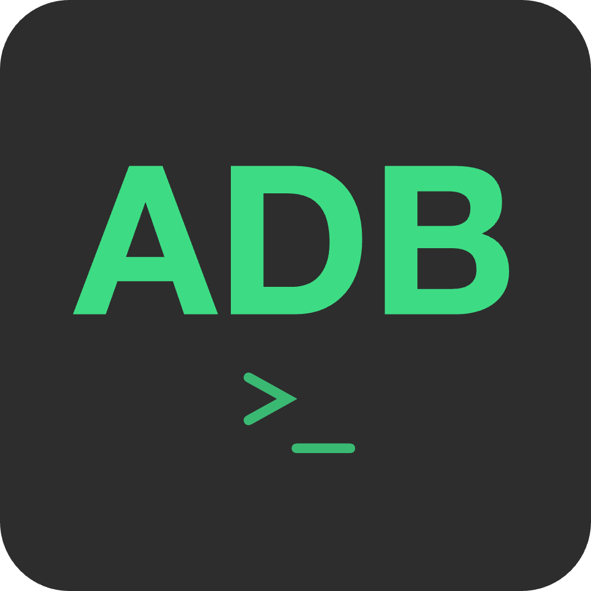

# ADB Tool

<div align="center">




一个现代化的 Android Debug Bridge (ADB) 图形界面工具，让 Android 设备管理变得简单直观。

[](LICENSE)
[](https://wails.io)
[](https://golang.org)
[](https://reactjs.org)

[功能特性](#功能特性) • [快速开始](#快速开始) • [开发计划](#开发计划) 

</div>

---

## 📋 功能特性

### 🔌 设备管理
- **设备列表** - 实时显示所有已连接的 Android 设备
- **设备信息** - 查看设备型号、Android 版本、序列号等详细信息
- **多设备支持** - 同时管理多台设备，快速切换
- **设备状态监控** - 实时监控设备连接状态

### 📦 应用管理
- **应用列表** - 查看设备上所有已安装的应用（系统应用/用户应用）
- **应用安装** - 选择 APK 文件快速安装
- **应用卸载** - 一键卸载不需要的应用
- **应用信息** - 查看应用包名、版本、安装路径等信息

### 📸 实用工具
- **屏幕截图** - 一键截取设备屏幕并保存到本地

### 🎨 用户体验
- **现代化界面** - 基于 React + Tailwind CSS 的美观界面
- **响应式设计** - 适配不同屏幕尺寸
- **中文本地化** - 完整的中文界面

---

## 📋 开发计划

### 🔜 近期计划

#### 📁 文件管理
- 文件浏览 - 浏览设备文件系统

#### 📸 实用工具
- 屏幕录制 - 录制设备屏幕操作
- 日志查看 - 实时查看 Logcat 日志
- Shell 终端 - 直接执行 ADB Shell 命令

#### 文件导出
- 分析 hprof 文件： View、Activity 的个数以及其到 GC Root 引用链、以及加载类等。

#### 应用管理页面
1. 支持解析应用 name、icon 等。
2. ApkVerified：获取 adb 签名信息，如 md5、sha1、sha256 等，可参考 jd-gui

---
## 🚀 快速开始

### 前置要求

- **ADB** - 确保系统已安装 Android Debug Bridge
    - Windows: [下载 Platform Tools](https://developer.android.com/tools/releases/platform-tools)
    - macOS: `brew install android-platform-tools`
    - Linux: `sudo apt install android-tools-adb`

- **USB 调试** - 在 Android 设备上启用 USB 调试
    1. 进入 **设置** → **关于手机**
    2. 连续点击 **版本号** 7 次启用开发者选项
    3. 返回 **设置** → **开发者选项** → 启用 **USB 调试**

### 安装

#### 方式 1: 下载预编译版本
访问 [Releases 页面](https://github.com/yourusername/adb-tool/releases) 下载适合你系统的版本：

- **Windows**: `adb-tool-windows-amd64.exe`
- **macOS**: `adb-tool-darwin-universal.app`
- **Linux**: `adb-tool-linux-amd64`

#### 方式 2: 从源码构建
```bash
# 克隆仓库
git clone https://github.com/ilpanda/adb-tool.git
cd adb-tool

# 安装依赖
go mod download
cd frontend && npm install && cd ..

# 构建
wails build

# 运行
./build/bin/adb-tool
```